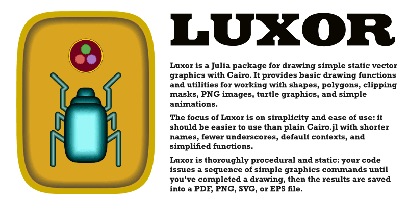
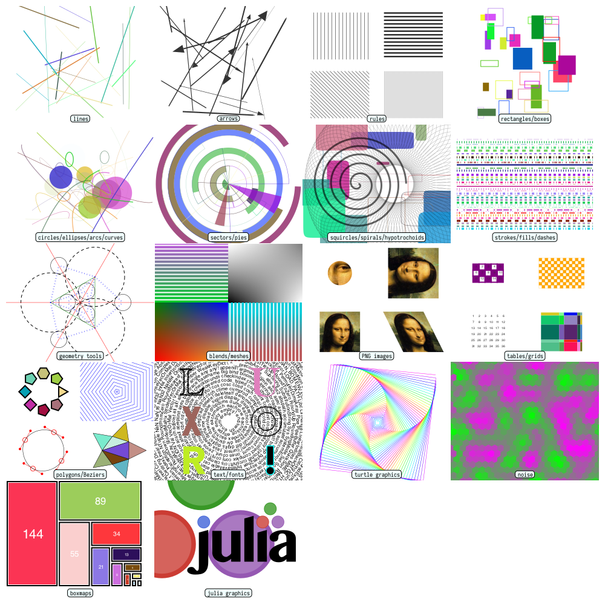

| **Documentation**                       | **Build Status**                          | **Code Coverage**               |
|:---------------------------------------:|:-----------------------------------------:|:-------------------------------:|
| [![][docs-stable-img]][docs-stable-url] | [![Build Status][travis-img]][travis-url] | [![][codecov-img]][codecov-url] |
| [![][docs-latest-img]][docs-latest-url] | [![Build Status][appvey-img]][appvey-url] |                                 |

## Luxor

Luxor is a Julia package for drawing simple static vector graphics. It provides basic drawing functions and utilities for working with shapes, polygons, clipping masks, PNG images, turtle graphics, and animations. Think of it as a high-level easier to use interface to [Cairo.jl](https://github.com/JuliaLang/Cairo.jl), with shorter names, fewer underscores, default contexts, and simplified functions. In Luxor, the emphasis is on simplicity and ease of use.

Luxor is thoroughly procedural and static: your code issues a sequence of simple graphics 'commands' until you've completed a drawing, then the results are saved into a PDF, PNG, SVG, or EPS file.

A short tutorial can be found in the documentation. There are some Luxor-related videos on [YouTube](https://www.youtube.com/channel/UCfd52kTA5JpzOEItSqXLQxg), and some Luxor-related blog posts at [cormullion.github.io/](https://cormullion.github.io/).

Luxor isn't interactive: for interactive graphics, look at [Gtk.jl](https://github.com/JuliaGraphics/Gtk.jl), and [GLVisualize](https://github.com/JuliaGL/GLVisualize.jl). [Makie](https://github.com/JuliaPlots/Makie.jl) is worth investigating.

## How can you contribute?

If you _know any geometry_ you probably know more than me, so there are plenty of improvements to algorithms waiting to be made. There are some _TODO_ comments sprinkled through the code, but plenty more opportunities for improvement.

_Update the code_, most of which was written for Julia versions 0.2, v0.3 and 0.4 (remember when broadcasting wasn't a thing?) so there are probably many areas where the code could take more advantage of version 1.

There can always be _more tests_, as the present tests are mainly visual, showing that something works, but there should be much more testing of things that shouldn't work - inappropriate input, overlapping polygons, coincident or collinear points, anticlockwise polygons, etc.

More _systematic error-handling_ particularly of geometry errors would be a good idea, rather than sprinkling `throw(error())`s around when things look wrong.

[docs-latest-img]: https://img.shields.io/badge/docs-latest-blue.svg
[docs-latest-url]: http://juliagraphics.github.io/Luxor.jl/latest/

[docs-stable-img]: https://img.shields.io/badge/docs-stable-blue.svg
[docs-stable-url]: http://juliagraphics.github.io/Luxor.jl/stable/

[pkgeval-link]: http://pkg.julialang.org/?pkg=Luxor

[pkg-0.5-img]: http://pkg.julialang.org/badges/Luxor_0.5.svg
[pkg-0.5-url]: http://pkg.julialang.org/detail/Luxor.html

[pkg-0.6-img]: http://pkg.julialang.org/badges/Luxor_0.6.svg
[pkg-0.6-url]: http://pkg.julialang.org/detail/Luxor.html

[pkg-0.7-img]: http://pkg.julialang.org/badges/Luxor_0.7.svg
[pkg-0.7-url]: http://pkg.julialang.org/?pkg=Luxor&ver=0.7

[travis-img]: https://travis-ci.org/JuliaGraphics/Luxor.jl.svg?branch=master
[travis-url]: https://travis-ci.org/JuliaGraphics/Luxor.jl

[appvey-img]: https://ci.appveyor.com/api/projects/status/jfa9e54lv92rqd3m?svg=true
[appvey-url]: https://ci.appveyor.com/project/cormullion/luxor-jl/branch/master

[codecov-img]: https://codecov.io/gh/JuliaGraphics/Luxor.jl/branch/master/graph/badge.svg
[codecov-url]: https://codecov.io/gh/JuliaGraphics/Luxor.jl
